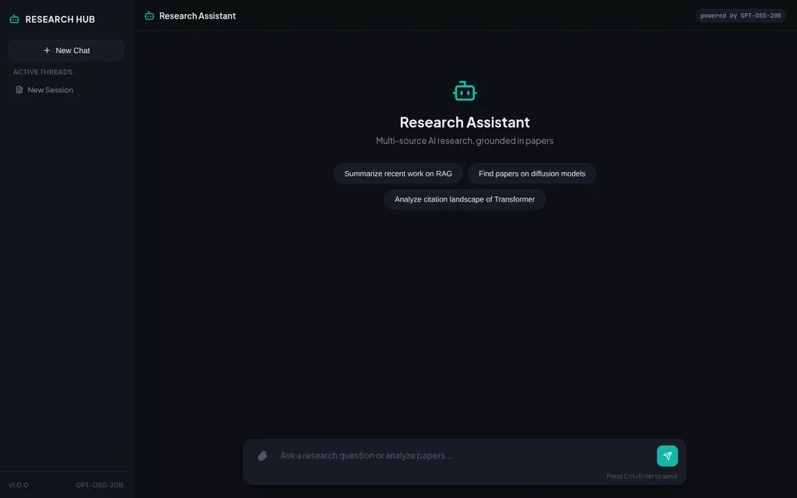
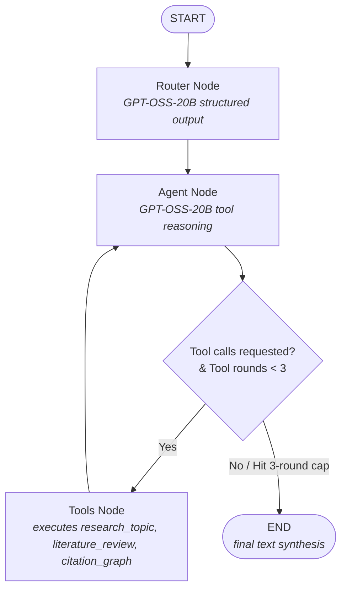

<div align="center">

# AI Research Assistant

**Multi-source research agent on LangGraph: hybrid dense + sparse RAG over user PDFs, live arXiv / Semantic Scholar / web search, and page-attributed citations streamed over SSE.**

[](backend/requirements.txt)
[](backend/api/app.py)
[](backend/api/agent/agent.py)
[](frontend/src/App.tsx)
[](backend/data_loaders/pdf_ingestion.py)
[](LICENSE)

</div>

A research assistant that ingests user-uploaded PDFs into a local vector database using section-aware chunking and hybrid search (dense + sparse BM25 + cross-encoder reranking). A LangGraph agent powered by NVIDIA-hosted GPT-OSS-20B (`openai/gpt-oss-20b`) dynamically selects reasoning tools, queries local documents alongside live academic APIs (arXiv, Semantic Scholar) and web search (Tavily), and streams responses plus tool invocation logs to the UI over Server-Sent Events.

<div align="center">



</div>

### Worked Example

Below is an example of querying the structured literature review endpoint (`POST /literature/review`):

```bash
curl -X POST "http://localhost:8000/literature/review" \
  -H "Content-Type: application/json" \
  -d '{
    "topic": "How does scaled dot-product attention compute token dependencies in Transformer models?",
    "n_db_results": 10,
    "min_hits": 3,
    "supplement_with_web": true,
    "supplement_with_arxiv": true
  }'
```

#### Response Structure *(Illustrative Example)*

```json
{
  "topic": "How does scaled dot-product attention compute token dependencies in Transformer models?",
  "review": "### Introduction\nScaled dot-product attention computes token interactions by taking the dot product of Query (Q) and Key (K) vectors, scaling by 1/sqrt(d_k), and applying a softmax function to obtain attention weights applied to Value (V) vectors (Vaswani et al., 2017, Methods, p.4)...\n\n### Key Themes & Findings\n1. **Scaling Factor Rationale**: The factor 1/sqrt(d_k) prevents dot products from growing large in high dimensions, which would push softmax into regions with extremely small gradients.\n2. **Matrix Computation**: Efficient parallel matrix multiplication allows simultaneous token interaction modeling across entire sequences.",
  "db_chunks": [
    {
      "text": "Scaled dot-product attention consists of queries and keys of dimension d_k, and values of dimension d_v. We compute the dot products of the query with all keys, divide each by sqrt(d_k), and apply a softmax function to obtain the weights on the values.",
      "score": 0.9412,
      "title": "Attention Is All You Need",
      "authors": "Ashish Vaswani, Noam Shazeer, Niki Parmar, Jakob Uszkoreit",
      "year": "2017",
      "doi": "10.48550/arXiv.1706.03762",
      "filename": "attention_is_all_you_need.pdf",
      "section": "Methods",
      "page_start": 4,
      "page_end": 5
    }
  ],
  "supplementary_papers": [
    {
      "title": "FlashAttention: Fast and Memory-Efficient Exact Attention with IO-Awareness",
      "authors": ["Tri Dao", "Daniel Y. Fu", "Stefano Ermon", "Atri Rudra", "Christopher Ré"],
      "venue": "NeurIPS",
      "abstract": "FlashAttention reorganizes GPU memory access between HBM and SRAM to compute exact attention without quadratic intermediate storage...",
      "year": 2022,
      "citations": 1450,
      "pdf_url": "https://arxiv.org/abs/2205.14135",
      "source": "semantic_scholar"
    }
  ],
  "errors": []
}
```

---

## Architecture

### 1. LangGraph Agent State Machine



### 2. Hybrid RAG Pipeline & PDF Ingestion

```mermaid
graph TD
    subgraph Ingestion Pipeline
        A[PDF Upload] --> B[pdfplumber Page Extraction]
        B --> C[Section-Aware Segmentation<br/><i>Abstract, Methods, Results...</i>]
        C --> D[Sentence-Aware Chunking<br/><i>512 tokens, 80 token overlap</i>]
        D --> E[BGE Embedding<br/><i>BAAI/bge-base-en</i>]
        E --> F[(ChromaDB Vector Store<br/><i>HNSW Cosine Index</i>)]
    end

    subgraph Query & Retrieval Pipeline
        Q[User Query] --> Dense[Dense Vector Search<br/><i>ChromaDB Query Embedding</i>]
        Q --> BM25[Sparse Lexical Search<br/><i>Rank-BM25 Tokenized Corpus</i>]
        Dense --> RRF[Reciprocal Rank Fusion<br/><i>RRF Score = 1 / 60 + rank</i>]
        BM25 --> RRF
        RRF --> Rerank[Cross-Encoder Reranker<br/><i>ms-marco-MiniLM-L-6-v2</i>]
        Rerank --> Context[Top-K Chunks<br/><i>with section & page metadata</i>]
        Context --> LLM[LLM Synthesis<br/><i>GPT-OSS-20B with Citations</i>]
    end
```



---

## Key Engineering Decisions

### Section-Aware Chunking with Page Attribution
Naive fixed-character or fixed-token chunking ignores PDF structural boundaries, often splitting sentences across section transitions (e.g., merging the end of an Abstract with the start of an Introduction). In `backend/data_loaders/pdf_ingestion.py`, the ingestion engine uses `pdfplumber` line streams passed to `_detect_section_heading`, which heuristically matches 25+ canonical academic headings (*Abstract*, *Methods*, *Experiments*, *Results*, etc.) while stripping numbering and Roman numerals. Lines are grouped into contiguous section segments before sentence-aware sliding-window chunking (512 tokens, 80-token overlap). Page attribution is calculated via linear character-offset interpolation across segment page ranges (`page_start` to `page_end`). *Limitation*: page interpolation assumes uniform text distribution per section segment across page boundaries.

### Hybrid Retrieval (Dense + Sparse) & Cross-Encoder Reranking
Dense vector embeddings (`BAAI/bge-base-en`) excel at capturing semantic intent but frequently miss specific keyword entities such as exact author names, dataset acronyms, or specialized mathematical terms. Sparse retrieval using `rank-bm25` (BM25Okapi) catches exact lexical matches. At query time in `query_db()`, candidate passages ($3 \times K$) are retrieved from both dense ChromaDB search and sparse BM25 indexing and fused using Reciprocal Rank Fusion (RRF):
$$RRF(d) = \sum_{m \in M} \frac{1}{60 + r_m(d)}$$
The top fused candidates are then passed through a cross-encoder reranker (`cross-encoder/ms-marco-MiniLM-L-6-v2`). This dual-stage design avoids expensive full-corpus cross-attention while delivering precise relevance scoring for final LLM context assembly.

### Citation Traceability
To eliminate ungrounded citations in generated reviews, metadata (`title`, `authors`, `year`, `doi`, `filename`, `section`, `page_start`, `page_end`) is stored alongside document text in ChromaDB and parsed into `LiteratureChunk` Pydantic models in `backend/services/literature_service.py`. When constructing prompts for GPT-OSS-20B, every context snippet includes source headers formatted as `[From: "Title" by Authors (Year) — Section: Methods, p.4-5]`. The system prompt instructs the model to cite exact primary sections and page ranges (e.g., `(Smith et al. 2021, Methods, p.4)`), establishing end-to-end traceability from the final response back to original PDF pages.

### Agent Architecture & Deterministic Controls
The agent loop (`backend/api/agent/agent.py`) is structured as a LangGraph state machine (`StateGraph`). A Router node invokes GPT-OSS-20B (`openai/gpt-oss-20b`) with structured output (`RouterOutput`) to select relevant tools up front. To prevent infinite agent execution loops and manage API costs, `should_continue` enforces a hard cap of 3 tool rounds (`_MAX_TOOL_ROUNDS = 3`). Once reached, the Agent node is invoked without tool bindings, forcing immediate text synthesis from gathered context. Real-time agent status, tool invocations, and token streams are delivered to the frontend over Server-Sent Events (SSE) using FastAPI's `StreamingResponse` wrapping `astream_events`.

---

## Evals

The project includes a comprehensive evaluation harness in `backend/evals/` designed to benchmark generation quality and retrieval performance across 25 realistic graduate-level AI/ML queries (`backend/evals/eval_set.json`).

### Methodology & Metrics
1. **Ragas Metrics**: Evaluates `faithfulness` (factual consistency), `answer_relevancy` (query alignment), `context_precision` (signal-to-noise ratio), and `context_recall` (ground truth coverage) using LLM-as-a-judge prompts.
2. **Keyword Recall Baseline**: Non-LLM deterministic metric measuring the exact case-insensitive match ratio of expected technical keywords (3–6 per query) in the generated output.

### Evaluation Results (GPT-OSS-20B)

| Metric | Average Score | Description |
|---|---|---|
| **Keyword Recall** | 0.8833 | Non-LLM substring match of expected domain terms |
| **Faithfulness** | 0.8692 | Measure of factual consistency between answer and retrieved context |
| **Answer Relevancy** | 0.9033 | Measure of how directly the generated answer addresses the question |
| **Context Precision** | 0.7839 | Signal-to-noise ratio of retrieved context chunks |
| **Context Recall** | 0.8529 | Measure of how well retrieved context covers the ground truth |

*See `backend/evals/results.md` for the full per-query breakdown and analysis.*
### Running Evals Locally
To execute the evaluation suite against a local backend server:

```bash
# 1. Install dependencies
pip install -r backend/requirements.txt

# 2. Start the FastAPI server
NVIDIA_API_KEY=your_nvidia_api_key TAVILY_API_KEY=your_tavily_api_key python backend/main.py &

# 3. Run the evaluation script
NVIDIA_API_KEY=your_nvidia_api_key BASE_URL=http://localhost:8000 python backend/evals/run_eval.py
```

Results are saved to [`backend/evals/results.md`](backend/evals/results.md). See [`backend/evals/eval_set.json`](backend/evals/eval_set.json) for the test set definitions.

---

## Tech Stack

| Category | Component | Technology / Library |
| --- | --- | --- |
| **Backend Framework** | Web API & Server | FastAPI, Uvicorn |
| **Agent Orchestration** | Graph State Machine | LangGraph (`StateGraph`), LangChain Core |
| **LLM Reasoning** | Language Model | `openai/gpt-oss-20b` via NVIDIA-hosted OpenAI-compatible API (`ChatOpenAI`) |
| **Vector Database** | Local Vector Store | ChromaDB (`PersistentClient`, HNSW Cosine Index) |
| **Embeddings & Reranking** | Dense & Reranker Models | `BAAI/bge-base-en`, `cross-encoder/ms-marco-MiniLM-L-6-v2` |
| **Sparse Retrieval** | Lexical Search Index | `rank-bm25` (BM25Okapi) |
| **External APIs** | Web & Paper Search | Tavily Search API, arXiv API, Semantic Scholar API |
| **Document Processing** | PDF Text & Layout Parsing | `pdfplumber`, `pypdf` |
| **Rate Limiting** | Middleware Protection | SlowAPI |
| **Frontend Framework** | UI Library & Build System | React 19, TypeScript, Vite |
| **Streaming Engine** | Real-Time Log & Token Stream | Server-Sent Events (SSE) via `ReadableStreamDefaultReader` |
| **Frontend Styling** | Theme & Components | Vanilla CSS (Dark Theme), `lucide-react`, `react-markdown` |

---

## Deployment

### Docker Compose Quickstart

Run the full stack (ChromaDB, FastAPI backend, Nginx-served React frontend) in containers:

```bash
docker compose up --build
```

#### Exposed Services & Ports
- **Frontend App**: `http://localhost:80`
- **Backend API**: `http://localhost:8000`
- **ChromaDB Vector DB**: `http://localhost:8001`

### Cloud Deployment (Self-Hosted)

The project is fully containerized — both `backend/` and `frontend/` ship standalone Dockerfiles, ready for 1-click deploys on Render, Railway, or Fly.io:

1. Create a new "Web Service", connect this repository.
2. Backend: set the Root Directory to `backend`, choose the Docker runtime, and supply `.env` variables (`NVIDIA_API_KEY`, `TAVILY_API_KEY`).
3. Frontend: set the Root Directory to `frontend` and inject the backend's public URL during the Docker build stage.

*Note: local Docker builds include heavy ML dependencies (PyTorch, HuggingFace embeddings) for the RAG pipeline — cloud providers may need 2–4GB RAM to run the backend container comfortably.*

*(No live cloud deployment is currently hosted.)*

---

## Getting Started (Local Development)

### Prerequisites
- **Node.js**: v18.0.0+
- **Python**: 3.10+
- **npm**: v8.0.0+

### Installation & Setup

1. **Clone the repository**
   ```bash
   git clone https://github.com/TanKaizokuO/research-assistant.git
   cd research-assistant
   ```

2. **Configure Backend Environment**
   ```bash
   cp backend/.env.example backend/.env
   ```
   Edit `backend/.env` with your API credentials:
   ```env
   GOOGLE_API_KEY=your_google_api_key_here
   TAVILY_API_KEY=your_tavily_api_key_here
   SEMANTIC_SCHOLAR_API_KEY=your_semantic_scholar_api_key_here
   LANGCHAIN_TRACING_V2=true
   LANGCHAIN_API_KEY=your_langsmith_api_key_here
   LANGCHAIN_PROJECT=research-assistant
   ```

3. **Install Backend Dependencies & Run**
   ```bash
   cd backend
   python -m venv .venv
   source .venv/bin/activate  # On Windows: .venv\Scripts\activate
   pip install -r requirements.txt
   python main.py
   ```
   *Backend starts at `http://localhost:8000`.*

4. **Install Frontend Dependencies & Run**
   ```bash
   cd ../frontend
   npm install
   npm run dev
   ```
   *Frontend starts at `http://localhost:5173`.*

---

## Observability

Agent executions, router decisions, tool latencies, and token consumption are automatically traced using **LangSmith**. Setting `LANGCHAIN_TRACING_V2=true` in `backend/.env` enables telemetry capture via the LangChain integration without code changes — no manual instrumentation required.

---

## License

Distributed under the MIT License. See `LICENSE` for details.

---

## Contributing

Contributions are welcome! Please feel free to open issues or submit pull requests:

1. Fork the project
2. Create a feature branch (`git checkout -b feature/AmazingFeature`)
3. Commit your changes (`git commit -m 'Add AmazingFeature'`)
4. Push to the branch (`git push origin feature/AmazingFeature`)
5. Open a Pull Request

---

## Contact

**TanKaizokuO** - [github.com/TanKaizokuO](https://github.com/TanKaizokuO) - tanishqbhattacharjee22@gmail.com

Project Link: [https://github.com/TanKaizokuO/research-assistant](https://github.com/TanKaizokuO/research-assistant)
